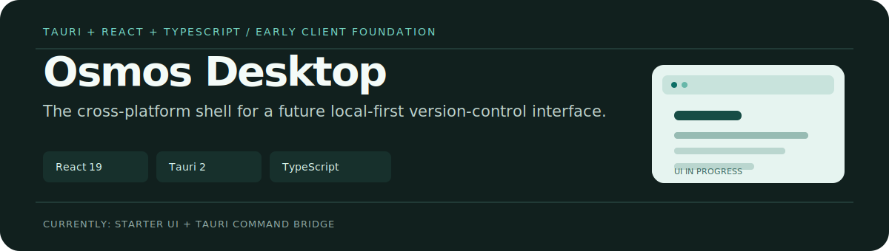

<p align="center">
  
</p>

# Osmos Desktop

This repository is the cross-platform desktop-client foundation for [Osmos](https://useosmos.com). It combines a Tauri 2 shell with a React 19 and TypeScript frontend, ready to grow into a graphical interface for the local version-control engine in [`osmos-core`](../osmos-core).

> Status: early foundation. The current UI is the starter screen and the Rust bridge exposes a sample `greet` command; repository management screens are not implemented here yet.

## Stack

- **Desktop runtime:** Tauri 2 + Rust
- **Frontend:** React 19, TypeScript, Vite
- **Intended engine:** the local `osmos-core` daemon

## Run locally

You need Node.js, npm, Rust, and the platform dependencies required by Tauri.

```bash
npm install
npm run tauri dev
```

For a production frontend build:

```bash
npm run build
```

## Current shape

```text
src/           React entry point and starter interface
src-tauri/     Tauri application, Rust command bridge, packaging settings
public/        Vite and Tauri static assets
```

The next product work belongs in the client layer: connecting to the local daemon, presenting repository status and history, and adding safe flows for commits and branches.

## License

MIT — see [LICENSE](./LICENSE). Consistent with [`osmos-core`](https://github.com/Osmos-App/osmos-core) and [`osmos-website`](https://github.com/Osmos-App/osmos-website).
