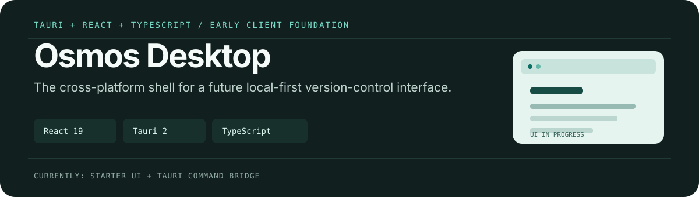

<p align="center">
  
</p>

# Osmos Desktop

[🇬🇧 English](README.md) · [🇹🇷 Türkçe](README.tr.md)

Bu depo, [Osmos](https://useosmos.com) için çapraz platform masaüstü istemcisi temelidir. Tauri 2 kabuğunu React 19 ve TypeScript ön ucu ile birleştirerek, [`osmos-core`](../osmos-core) içindeki yerel versiyon kontrolü motoru için grafiksel bir arayüze dönüşmeye hazır bir temel sunar.

> Durum: Erken aşama temel. Mevcut kullanıcı arayüzü başlangıç ekranıdır ve Rust köprüsü örnek bir `greet` komutu sunar; repository yönetim ekranları henüz burada uygulanmamıştır.

## Teknoloji Yığını (Stack)

- **Masaüstü çalışma zamanı:** Tauri 2 + Rust
- **Ön Yüz (Frontend):** React 19, TypeScript, Vite
- **Hedeflenen motor:** Yerel `osmos-core` daemon'ı

## Yerel Olarak Çalıştırma

Node.js, npm, Rust ve Tauri tarafından gereksinim duyulan platform bağımlılıklarına ihtiyacınız vardır.

```bash
npm install
npm run tauri dev
```

Üretim ön yüz derlemesi için:

```bash
npm run build
```

## Mevcut Yapı

```text
src/           React giriş noktası ve başlangıç arayüzü
src-tauri/     Tauri uygulaması, Rust komut köprüsü, paketleme ayarları
public/        Vite ve Tauri statik varlıkları
```

Sonraki ürün geliştirmeleri istemci katmanına aittir: yerel daemon'a bağlanmak, repository durumunu ve geçmişini sunmak, commit'ler ve branch'ler için güvenli akışlar eklemek.

## Lisans

MIT — [LICENSE](./LICENSE) dosyasına bakabilirsiniz. [`osmos-core`](https://github.com/Osmos-App/osmos-core) ve [`osmos-website`](https://github.com/Osmos-App/osmos-website) ile tutarlıdır.
